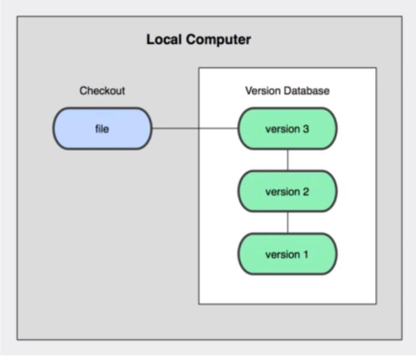
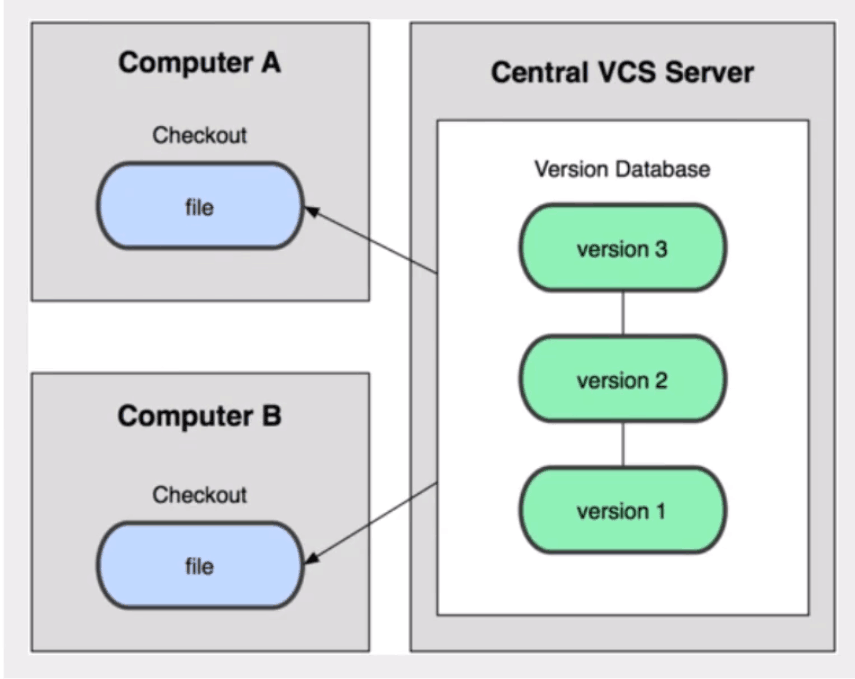

# 版本控制
## concept: 
(Revision control)是一种在开发的过程中用于管理我们对文件、目录或工程等内容的修改历史，方便查看更改历史记录，备份以便回复以前的版本的软件工程技术。
- 实现跨区域多人协同开发
- 追踪和记载一个或者多个文件的历史记录
- 组织和保护你的源代码和文档
- 统计工作量
- 并行开发、提高开发效率
- 跟踪记录整个软件的开发过程
- 减轻开发人员的负担，节省时间，同时降低人为错误 
总结：用于管理多人协同开发项目的技术
## 主流版本控制器
- Git
- SVN(subversion)
- CVS(Concurrent Versions System)
- VSS(Microsoft Visual SourceSafe)
- TFS(Team Foundation Server)
- Visual studio online
## 版本控制分类
- 本地版本控制 
  记录文件每次的更新，可以对每个版本做一个快照，或是记录补丁文件
  
- 集中版本控制(SVN) 
  所有版本数据都保存在服务器上，协同开发者从服务器上同步更新或上传自己的修改
  
- 分布式版本控制(Git) 
  所有版本信息仓库全部同步到本地的每个用户，可以在本地查看所有版本历史，可以离线在本地提交
  
# 基本的Linux学习命令
- cd      改变目录(cd+目录)
- cd..    回退到上一级目录
- pwd     显示当前所在的目录路径
- ls      列出当前目录中的所有文件
- touch   新建一个文件
- rm      删除一个文件
- mkdir   新建一个目录(新建一个文件夹)
- rm -r   删除一个文件夹
- reset   重新初始化终端
- clear   清屏
- history 查看
- help    帮助
- exit    退出
# Git基本理论
## 工作区域
- Git本地有三个工作区域: 工作目录(Working Directory)、暂存区(Stage/index)、资源库(Repository Directory)。加上远程的git仓库(Remote Directory)就可以分为四个工作区域 
- 转换关系：
  
- Workspace: 工作区，平时存放项目代码的地方
- Index/Stage: 暂存区，用于临时存放的改动(只是一个文件，保存即将提交到文件列表信息)
- Repository: 仓库区(本地仓库)，就是安全存放数据的位置。这里面有你提交到所有版本的数据。其中HEAD指向最新放入仓库的版本
- Remote: 远程仓库，托管代码的服务器，可以简单的认为是你项目组中的一台电脑用于远程数据交换
## 工作流程
1.在工作目录中添加、修改文件 
2.将需要进行版本管理的文件放入暂存区域 
3.将暂存区域的文件提交到git仓库 

## Git项目搭建
- 本地仓库搭建--git init
- 克隆远程仓库--git clone
## git文件操作
- 文件四种状态
  - Untracked:未跟踪，此文件在文件夹中，但并没有加入到git库，不参与版本控制，通过**git add**状态变为**Staged**
  - Unmodify:文件已经入库，未修改，即版本库中的文件快照内容与文件夹中完全一致，这种类型的文件有两种去处，如果被修改就变为**Modified**，如果使用**git rm**移除版本库，则成为**Untracked**文件
  - Modified:文件已修改，仅仅是修改，并没有进行其他的操作，这种类型的文件也有两种去处，通过**git add**可进入暂存**Staged**状态，使用**git checkout**则丢弃修改，返回到**Unmodify**状态
  - Staged:暂存状态，执行**git commit**则将修改同步到库中，这时库中的文件和本地文件又变为一致，文件为**Unmodify**状态，执行**git reset HEAD filename**取消暂存，文件状态为**Modified**
- 查看文件状态
  - git status [filename]--查看指定文件状态
  - git status--查看所有文件状态
  - git add.--添加所有文件到暂存区
  - git commit -m "消息内容"--提交暂存区中的内容到本地仓库 -m 提交信息
- 忽略文件
  当不想把某些文件纳入版本控制中，比如数据库文件，临时文件，设计文件等
  在主目录下建立".gitgnore"文件，此文件有如下规则
  - 忽略文件中的空行或以井号(#)开始的行将会被忽略
  - 使用Linux通配符。例如：星号(*)代表任意多个字符，问好(?)代表一个字符，方括号([abc])代表可选字符范围，大括号({string1,string2,...})代表可选的字符串等
  - 名称的最前面有一个感叹号(!)，表示例外规则，将不被忽略
  - 名称的最前面是一个路径分隔符(/)，表示要忽略的文件在此目录下，而子目录中的文件不忽略
  - 名称的最后面面是一个路径分隔符(/)，表示要忽略的文件在此目录下该名称的子目录，而非文件